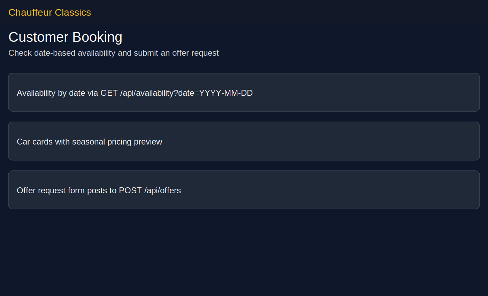
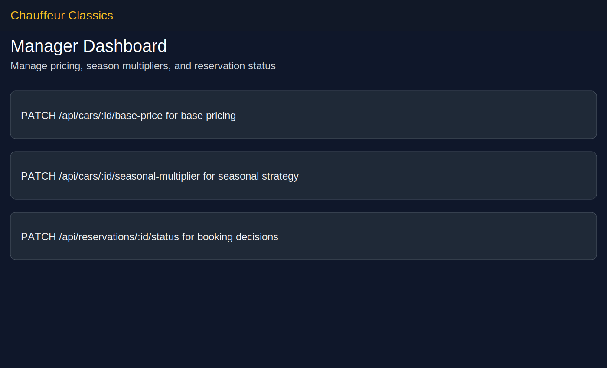
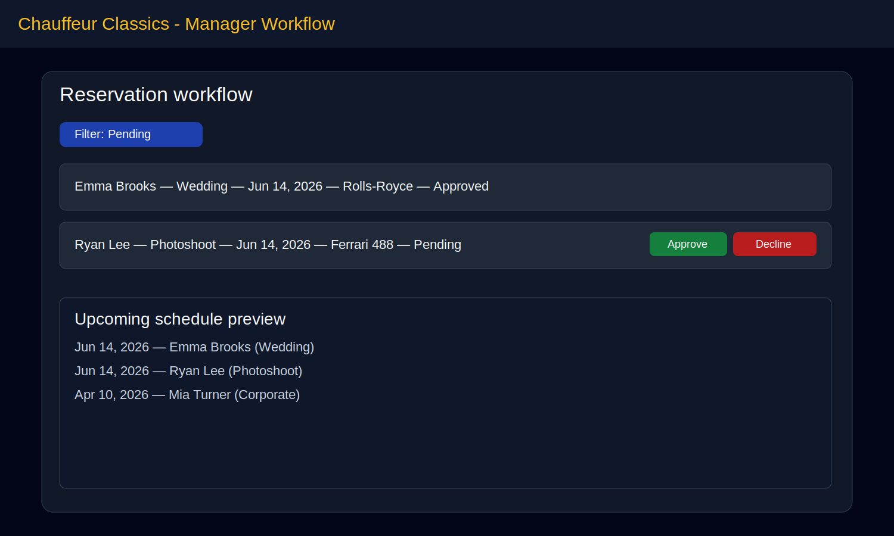
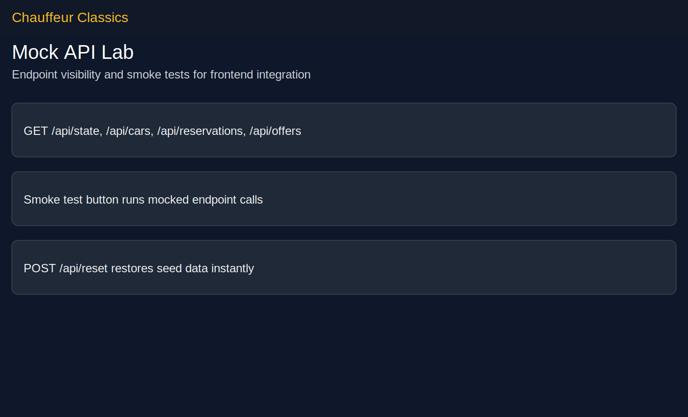

# Chauffeur Web Frontend (React)

Modern React + TypeScript frontend for booking vintage/exotic cars for special events.

## Must-have features implemented

- Date-based car availability for customers (`GET /api/availability?date=...`).
- Customer offer request flow with event type, guest count, and message.
- Manager workspace for reservation approvals/declines.
- Fleet and seasonal pricing controls per car.
- Centralized app state synchronized through API-style calls.

## Nice-to-have features implemented

- Smart quote snapshot on customer flow.
- Fleet filtering by category, seats, and max budget.
- Manager insights (utilization, top event segment, schedule preview).
- Pricing presets for seasonal strategies.
- API Lab page to smoke-test mock endpoints.
- Responsive glassmorphism-inspired visual style.

## Mock API (in-browser) for endpoint testing

The app installs a mock API that intercepts `/api/*` calls in the browser and stores data in `localStorage`.

### Available endpoints

- `GET /api/state`
- `GET /api/cars`
- `POST /api/cars`
- `PATCH /api/cars/:id/base-price`
- `PATCH /api/cars/:id/seasonal-multiplier`
- `GET /api/reservations`
- `PATCH /api/reservations/:id/status`
- `GET /api/offers`
- `POST /api/offers`
- `GET /api/availability?date=YYYY-MM-DD`
- `POST /api/reset`

Use the **API Lab** page (`/api-lab`) to smoke test endpoint behavior and inspect sample payloads.

## Screenshots

### Home experience


### Customer booking filters & quote


### Manager operations center


### Reservation workflow focus


### Mock API lab


## Getting started

```bash
npm install
npm run dev
```

## Quality checks

```bash
npm run lint
npm run test
npm run build
```

## Notes for backend integration

- Replace the mock API interceptor with real C# backend endpoints.
- Keep DTO/domain model alignment via `src/types` and `src/api/appApi.ts`.
